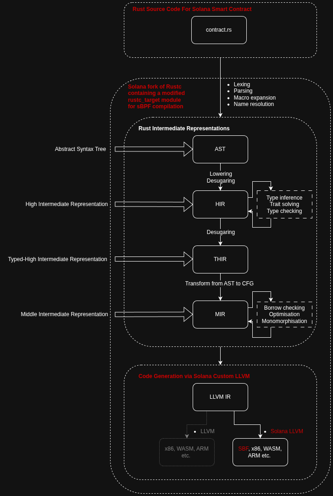

# Lecture 5. Solana Virtual Machine (SVM) - Memory and Execution

---

This lecture connects the abstract model of memory and execution we’ve explored so far with the Solana runtime environment. We’ll take a **top-down view** of how a Solana validator executes programs (smart contracts) using the Solana Virtual Machine (SVM).

We’ll look at three key layers:

1. **Validators and memory** - how it represents and manages blockchain state in memory.
2. **Compilation and deployment** - how a Rust program is compiled into **sBPF bytecode**, and why Solana uses a modified toolchain.
3. **Program execution** - how a deployed program is invoked and run inside the sBPF virtual machine.

Each part connects Rust’s memory model (ownership, stack, heap, and safety) to how Solana maintains isolation, determinism, and performance across a distributed network of validators.

## Solana Validators and Memory

Before we look at bytecode, virtual machines, and program execution, it helps to ground ourselves in what actually runs on a validator node.

Every validator is just a process - a long-running Rust (or C++) program - that maintains Solana’s state, executes transactions, and participates in consensus.

Understanding this process and its memory layout will make it much easier to reason about how sBPF programs are executed later.

> [Solana Validator Visualiser](https://stellar-cuchufli-3d1ff3.netlify.app/validator-overview) **<— Start with the visualiser to get some intuition!**
> 

### Solana Validator as a Rust Process

A **validator** is a long-running Rust (or C++) program compiled to native x86 or ARM machine code - we will focus on [Agave](https://github.com/anza-xyz/agave) with Rust to x86. Its main job is to participate in Solana’s consensus and execute transactions deterministically, updating a shared global state known as the **blockchain**.

At a high level, a validator is responsible for:

- **Transaction processing:** verifying, executing, and recording transactions into blocks.
- **State management:** maintaining account data, program code, and runtime metadata.
- **Consensus participation:** voting and propagating blocks across the network.

While we often describe the “blockchain” as an abstract sequence of accounts and transactions, inside the validator this is just data in memory — not a literal on-chain structure.

All account data and program state must live inside the memory of the computers that make up the network in some way. The “blockchain” is effectively a consistent view of this in-memory data, agreed upon by all validators through consensus and replay of transactions.

Each validator maintains:

- A [**Bank**](https://github.com/anza-xyz/agave/blob/56d328c2e369c29b39c999776aa4ba0de543ae00/runtime/src/bank.rs#L727-L925) - a temporary working state representing a candidate block’s transactions.
- The [**AccountsDB**](https://github.com/anza-xyz/agave/blob/56d328c2e369c29b39c999776aa4ba0de543ae00/accounts-db/src/accounts_db.rs#L1083-L1219) - storing all accounts and program data.
- Runtime components - including the [**SVM**](https://github.com/anza-xyz/agave/blob/master/svm/doc/spec.md), which executes transactions and invokes [**sBPF**](https://github.com/anza-xyz/sbpf) to execute onchain smart contract programs safely within isolated memory regions.

Not every transaction requires invoking a smart contract. Many are **native runtime operations** (such as vote transactions, rewards distribution, or system account management) that execute directly as Rust functions inside the validator without entering the sBPF virtual machine.

### Determinism and Isolation

Each validator must produce exactly the same result for a given sequence of transactions, regardless of hardware, OS, or timing. To guarantee this, the Solana runtime enforces **deterministic execution** and **memory isolation** between transactions and programs.

When an sBPF program runs, it operates in a sandboxed memory region, isolated from the validator’s own memory and from other programs. This prevents one contract from corrupting another’s state and ensures consistent execution across the network.

### Concurrency and Parallel Execution

Solana’s runtime is designed for parallelism. Each transaction declares which accounts it will read and write, allowing the validator to execute independent transactions **concurrently** while locking accounts that overlap.

This **account-level concurrency model** enables high throughput without sacrificing safety. When a transaction needs **write access**, its accounts are locked with exclusive access preventing any other transaction from reading or writing them at the same time. When a transaction only needs **read access**, its accounts are locked in a shared, read-only mode, allowing multiple transactions to read concurrently.

This mechanism is a direct analogue to Rust’s rule of **“aliasing XOR mutability”** - either many readers or one writer, but never both.

### Persistence of State

While much of the validator’s state resides in RAM for performance, it is periodically **flushed to disk** and checkpointed. This allows validators to restart, replay the ledger, and rebuild state deterministically from prior blocks — ensuring continuity even if individual nodes fail.

In essence:

> There is no abstract blockchain in the validator’s memory - only structured data, algorithms, and network protocols ensuring all validators evolve that data stored in memory in the same deterministic way.
> 

This grounding will help us reason about how programs compiled to sBPF bytecode interact with validator memory during execution.

## Solana Smart Contract Compilation and Deployment

> [Contract Compilation Visualiser](https://stellar-cuchufli-3d1ff3.netlify.app/contract-deploy) **<— Start with the visualiser to get some intuition!**
> 

A **Solana smart contract** begins as Rust source code, but it is compiled using a **Solana-specific Rust toolchain** into **sBPF bytecode** - a restricted instruction set derived from

**eBPF**. This bytecode is then deployed as an ELF binary (.so extension) to the blockchain via a transaction, and executed by a subsequent transaction that instantiates an sBPF within validators.

### Background: eBPF

[**eBPF](https://ebpf.io/what-is-ebpf/) (extended Berkeley Packet Filter)** originated in the Linux kernel as a way to safely run custom packet-filtering code without introducing kernel-level security risks. While originally used for network filtering, eBPF evolved into a **high-performance sandboxed virtual machine** capable of running user-defined programs inside the kernel with near-native speed.

The key design goal was to allow safe, dynamic execution of small, verifiable programs within privileged environments.To achieve this, eBPF enforces:

- **Static verification** of all code before execution (no arbitrary jumps, invalid memory, or unsafe pointer access).
- **Strictly bounded memory regions** for the stack and global data - no heap.
- **A simple RISC-like instruction set** with deterministic behavior.

The power of being able to run **user-written code safely inside the kernel** cannot be understated. Before eBPF, extending kernel behavior required writing and loading new kernel modules which was slow and prone to causing system crashes.

With eBPF, developers could now write small, verifiable programs that modify kernel behavior **without recompiling or rebooting**, enabling far faster experimentation and observability tools.

In other words, eBPF executes fast, verifiable programs in a *constrained but safe* environment - an idea very attractive for blockchain runtimes that must be deterministic and secure.

### Why Solana Uses an eBPF-like Virtual Machine

Solana adopted and extended the eBPF model to create **sBPF (Solana BPF)**, a specialised virtual machine designed for deterministic, sandboxed program execution across thousands of validators.

Key motivations:

- **Determinism:** every validator must produce exactly the same result for the same program and input.
- **Safety:** user code is executed in a controlled sandbox that has limited and defined access to the outside validator.
- **Performance:** BPF’s simple instruction model allows near-native JIT execution speeds.

Because Solana validators must all agree on state transitions, **true concurrency inside sBPF programs is disabled**, each program executes deterministically within it’s isolated memory space. Concurrency exists only at the validator level, through independent account-level transaction parallelism (discussed earlier).

### Solana’s Forked Rust Toolchain

### Rust

Smart contracts on Solana are written in Rust but compiled using a [**fork of the Rust compiler**](https://github.com/anza-xyz/rust) maintained by Solana/Anza. The Rust fork itself is relatively small in it’s changes, with most being introduced downstream. The goal is add new **compilation targets** for compiling to sBPF which are added to the [rustc_target](https://github.com/anza-xyz/rust/blob/88a5a9f1a7b8460a24dc11426fed53bfb3941698/compiler/rustc_target/src/spec/mod.rs#L2049-L2055) module. These targets are connected with a [build script that instructs LLVM](https://github.com/anza-xyz/rust/blob/solana-1.89.0/compiler/rustc_target/src/spec/base/sbf_base.rs) (again a solana custom fork) on the format requested for compilation which define how the code generation should emit sBPF-compatible code.

Note that unlike the Rust compiler that builds the validator (which targets `x86_64-unknown-linux-gnu`), this forked toolchain is specialized to produce **sBPF bytecode** rather than native machine code. So to compile a validator the regular Rust toolchain is used, but to compile a sBPF smart contract that will run on that validator a custom fork of the Rust toolchain is used.

### LLVM

The forked Rust toolchain will invoke a [**custom LLVM backend**](https://github.com/anza-xyz/llvm-project) (in C++) targeted at the sBPF instruction-set instead of the existing machine-code instruction-sets that LLVM supports (x86, ARM, etc.). The pipeline through this software is the Rust MIR is translated to LLVM IR, from here it is the specific target backends that define and perform the conversion and lowering to their bytecode format. To support this, the Solana team introduced a bespoke [SPF target](https://github.com/anza-xyz/llvm-project/tree/solana-rustc/20.1-2025-02-13/llvm/lib/Target/SBF) in their LLVM fork.

The compiled output is a **position-independent ELF binary** containing sBPF bytecode and metadata, ready to be deployed to an account on the blockchain.

While the backend code generation layer relies on **C++ (LLVM)**, most of the surrounding **tooling and deployment pipeline** including linking, metadata generation, and account packaging is implemented in Rust.

### Illustrating The Differences

The original Rust compiler pipeline (that which is used to compile the agave validator):



The solana Rust compiler pipeline for sBPF (notice most of the components are the same):


### Limitations

Solana’s compiler and runtime deliberately restrict what programs can do to preserve **determinism** and fit a **single-threaded, resource-bounded** virtual machine. These [limitations](https://solana.com/docs/programs/limitations) include:

- No access to **system I/O** (files, sockets, processes, or environment).
- No **thread creation** or parallel execution inside a program.
- No **randomness sources** or system clocks since all execution must be deterministic.
- Only a **subset of floating-point operations** is supported; those operations are **software-emulated** via sBPF runtime sub-routines rather than executed natively by hardware.
- No **mutable static or global variables** as shared objects must be read-only.
- **Recursive functions** are disallowed to guarantee a bounded call stack.
- **Program size** of a compiled ELF program storing a binary is 10MiB (minus metadata), the BPFLoader will [reject anything larger](https://github.com/anza-xyz/agave/blob/7c32878f4d9e2e358e1390797180d30afca5e844/programs/bpf_loader/src/lib.rs#L554-L557).
- **Program memory** the **stack depth** is restricted to 64 call frames, and the resource limits for what is allowable in the other memory segments are confusing (ask in class), it appears there may of been hard limits enforced before but now virtual memory limits of 4GiB appear to be the theoretical limit. But of course the economic boundary of compute units will be a real limitation.
- **Compute budget** limits instruction count economically and prevents long-running or unbounded loops.

By removing nondeterministic and platform-dependent behavior, the compiler and verifier ensure that a program produces **identical results on every validator**, preserving consensus safety and enabling efficient static verification of memory and control-flow.

### Deploying The Compiled Smart Contract

Once a smart contract (program) is compiled to an **sBPF ELF binary**, it must be

**deployed to the blockchain** before it can be invoked. Deployment is handled entirely through standard Solana transactions that create and populate an on-chain **program account**.

### The Deployment Process (v4)

1. **Program account creation**
A new account is created on-chain to store the compiled ELF data. This account must be large enough to hold the full program image and be rent-exempt ([have 2 years of lamports provided with the transaction](https://github.com/anza-xyz/pinocchio/blob/bde84880a6709bbda4da8767b5f0a42d9678d07c/sdk/pinocchio/src/sysvars/rent.rs#L39-L41)), since programs are expected to persist indefinitely.
    
    The account’s owner is initially the **BPF loader program [BPFLoaderUpgradeab1e11111111111111111111111](https://github.com/anza-xyz/agave/blob/master/programs/bpf_loader/src/lib.rs)** ([sdk id declaration](https://github.com/anza-xyz/solana-sdk/blob/a7e12b1d4af8fba2a43d447af31aebdc3dbe8a1d/sdk-ids/src/lib.rs#L16-L18)). It is created by the **system account** function [create_account](https://github.com/anza-xyz/agave/blob/7c32878f4d9e2e358e1390797180d30afca5e844/programs/system/src/system_processor.rs#L146-L179), and the rent logic (e.g. [minimum_balance](https://github.com/anza-xyz/pinocchio/blob/bde84880a6709bbda4da8767b5f0a42d9678d07c/sdk/pinocchio/src/sysvars/rent.rs#L182-L213)) is handled by sysvars in the sdk.
    
2. **Loading the ELF binary**
The compiled ELF file is uploaded in **chunks** via a series of write instructions that populate the account’s data field. First the program account is set to have enough length to store the ELF file with the [SetProgramLength](https://github.com/anza-xyz/solana-sdk/blob/a7e12b1d4af8fba2a43d447af31aebdc3dbe8a1d/loader-v4-interface/src/instruction.rs#L44-L60) instruction, then several [Write](https://github.com/anza-xyz/solana-sdk/blob/a7e12b1d4af8fba2a43d447af31aebdc3dbe8a1d/loader-v4-interface/src/instruction.rs#L16-L27) instructions send the chunks of the ELF file to be written to the account’s data field. Each write transaction consumes compute units and must respect Solana’s transaction size limits; CLI tools handle chunking automatically.
3. **Verification and finalisation**
Once all ELF segments are uploaded, the loader executes the [Deploy](https://github.com/anza-xyz/solana-sdk/blob/a7e12b1d4af8fba2a43d447af31aebdc3dbe8a1d/loader-v4-interface/src/instruction.rs#L62-L74) instruction that verifies that the image is a valid and well-formed **sBPF program** (more on this later) ****and marks the account as executable. A [Finalize](https://github.com/anza-xyz/solana-sdk/blob/a7e12b1d4af8fba2a43d447af31aebdc3dbe8a1d/loader-v4-interface/src/instruction.rs#L94-L100) instruction may optionally be sent to mark the account as immutable (accounts are opt-in immutable).
4. **The sBPF program is now on chain**
The ELF binary is now successfully stored in the executable account and after sufficient time has passed the smart contract can be invoked by another transaction.

## Solana Execution of Deployed Smart Contract

> [Contract Execution Visualiser](https://stellar-cuchufli-3d1ff3.netlify.app/contract-execute) **<— Start with the visualiser to get some intuition!**
> 

Once a deployed program is marked **executable**, any transaction can invoke it by referencing the program’s public key in its instruction list. Execution happens inside the **Solana Virtual Machine (SVM)**, as mentioned in the above sections this is a deterministic runtime environment that manages the memory model, instruction dispatch, and syscall interface for **sBPF bytecode**.

### The Execution Process - Validator Perspective

**1. Transaction Dispatch**
A transaction enters the runtime through the SVM's message processor. The entry point is [`process_message()`](https://github.com/anza-xyz/agave/blob/e42b04fcac056ebdb7c465418f77b8b28ce6b760/svm/src/message_processor.rs#L10-L73), which iterates over each instruction in the transaction and dispatches them for execution by the runtime.

---

**2. Instruction Setup**
For each instruction, the runtime calls [`process_instruction()`](https://github.com/anza-xyz/agave/blob/e42b04fcac056ebdb7c465418f77b8b28ce6b760/program-runtime/src/invoke_context.rs#L487-L499) in the program runtime layer. This function sets `process_executable_chain()` which will processes which **BPF Loader** to use.

---

**3. Loader Entrypoint Invocation**
Once the program to execute is identified, [`vm.invoke_function(function)`](https://github.com/anza-xyz/agave/blob/e42b04fcac056ebdb7c465418f77b8b28ce6b760/program-runtime/src/invoke_context.rs#L579) calls into the registered entrypoint for the **BPF Loader**. Note this is not the execution of the smart contract yet, but the execution of the loader to load the smart contract.

The loader [`entrypoint`](https://github.com/anza-xyz/agave/blob/e42b04fcac056ebdb7c465418f77b8b28ce6b760/programs/bpf_loader/src/lib.rs#L357-L370) calls [`process_instruction_inner`](https://github.com/anza-xyz/agave/blob/e42b04fcac056ebdb7c465418f77b8b28ce6b760/programs/bpf_loader/src/lib.rs#L376-L434) and acts as the bridge between the validator's host process and the sBPF virtual machine.

The results of the vm's execution are [evaluated after the invocation](https://github.com/anza-xyz/agave/blob/e42b04fcac056ebdb7c465418f77b8b28ce6b760/program-runtime/src/invoke_context.rs#L580-L606), but this is after the smart contract has finished execution of course.

---

**4. ELF Preparation and Verification**
Inside the loader, [`process_instruction_inner()`](https://github.com/anza-xyz/agave/blob/e42b04fcac056ebdb7c465418f77b8b28ce6b760/programs/bpf_loader/src/lib.rs#L376-L434) is called to read and verify the program's ELF data. It checks that the bytecode and section layout conform to the sBPF specification, ensures the instruction set is valid, and prepares the VM instance.

Once verified the [loaded program approved for execution](https://github.com/anza-xyz/agave/blob/e42b04fcac056ebdb7c465418f77b8b28ce6b760/programs/bpf_loader/src/lib.rs#L430), [`execute()`](https://github.com/anza-xyz/agave/blob/e42b04fcac056ebdb7c465418f77b8b28ce6b760/programs/bpf_loader/src/lib.rs#L1440-L1646) (truly a monster function - take a look it’s no joke) sets up the sBPF environment (memory regions, registers, and the syscall interface) before handing off control to the virtual machine.

---

**5. sBPF Execution**

The loader then calls [`vm.execute_program()`](https://github.com/anza-xyz/agave/blob/e42b04fcac056ebdb7c465418f77b8b28ce6b760/programs/bpf_loader/src/lib.rs#L1520), which transfers execution into the **sBPF Virtual Machine** (**interpreter** or **JIT backend**) implemented in the [`anza-xyz/sbpf`](https://github.com/anza-xyz/sbpf) repository.

**See The Execution Process - sBPF VM Perspective** below

At this stage, your compiled Rust function (the `entrypoint!` macro in your program crate) executes entirely within the sandboxed VM.

Memory access, instruction count, and all external interactions are tightly controlled and metered by the runtime.

---

**6. Completion and State Commit**

When execution finishes, the VM returns a status code to the loader. The SVM then commits any modifications made to writable accounts, releases locks, and records the result of the transaction in the Bank. If an error or panic occurs, the runtime rolls back all changes to preserve deterministic state across validators.

---

### **Isolation Boundary**

All steps up to the **BPF loader** run in the **validator host process** (native Rust code compiled to x86/ARM). Once the loader invokes `vm.execute_program()`, control transfers into the **sBPF VM**, where your contract executes in a strictly sandboxed memory space.

The only permitted communication between these environments occurs through the verified syscall interface.

### The Execution Process - sBPF VM Perspective

**1. Loading the ELF File**

[struct Executable](https://github.com/anza-xyz/sbpf/blob/163efda92dcb4a7281fe462127170931efc0dc84/src/elf.rs#L232-L254) represents the loaded program (which is read from chain), information on locations of .text and .rodata sections, program counter, function call information, and compiled program (if JIT). This struct is cached by the validator to be used whenever the program is invoked and is the main data structure of the smart contract execution. The ELF is parsed via [Executable::load](https://github.com/anza-xyz/sbpf/blob/163efda92dcb4a7281fe462127170931efc0dc84/src/elf.rs#L374-L402) which takes the raw ELF file as parameter `bytes`, and parameter `loader` which is the program runtime environment. `loader` is a shared, cached configuration created by the validator at startup/epoch boundaries that contains things like sBPF VM config and syscall registries for the VM to use.

---

**2. Verification**

The entrypoint to verification is [Executable::verify](https://github.com/anza-xyz/sbpf/blob/163efda92dcb4a7281fe462127170931efc0dc84/src/elf.rs#L312-L322) which calls [RequisiteVerifier::verify](https://github.com/anza-xyz/sbpf/blob/163efda92dcb4a7281fe462127170931efc0dc84/src/verifier.rs#L225-L452) that performs the verification checks. If these succeed, the program is considered well-formed. The checks that might be performed are:

- That the program is not empty and is divisible by the instruction length;
- That the program counter starts at a valid instruction to begin program execution;
- That no non-sBPF opcodes exist in the compiled program;
- That registers referenced are in range (`r0`-`r11`);
- That the frame pointer (`r10`) has write permissions;
- That immediate values have correct alignment and ranges;
- That bit shift amounts are in valid range;
- That each Load/Store instructions use valid registers;
- That each Jump instruction has a valid offset to jump to (in function bounds and valid function starts);
- That immediate division does not attempt to divide by zero;
- That the syscalls used exist in the registry;

---

**3. VM Initialisation**

The data structure that represents the runtime of the executing smart contract is the [struct EbpfVm](https://github.com/anza-xyz/sbpf/blob/163efda92dcb4a7281fe462127170931efc0dc84/src/vm.rs#L218-L305). A new VM instance is created by [EbpfVm::new](https://github.com/anza-xyz/sbpf/blob/163efda92dcb4a7281fe462127170931efc0dc84/src/vm.rs#L308-L348) which zero initialises the registers

- `r0`: Return value
- `r1-r5`: Function arguments and scratch
- `r6-r9`: Callee-saved (preserved across calls)
- `r10`: Stack frame pointer (`FRAME_PTR_REG`)
- `pc`: Program counter (hidden / not a register)

`r10` is set to an address within the stack region that is offset by the first frame size (config dependent). Memory mapping between the VM and the host is configured, call frames are allocated (to `max_call_depth`), and runtime information is initialised.

---

**4. Execution**

Once an `EbpfVm` instance is created, it can execute a provided `Executable` with [EbpfVm::execute_program](https://github.com/anza-xyz/sbpf/blob/163efda92dcb4a7281fe462127170931efc0dc84/src/vm.rs#L350-L403), which takes a boolean parameter `interpreted` to select interpreted or JIT compiled execution. Prior to execution, the VM:

- Sets the program counter to the entrypoint function location;
- Initialises the instruction metering (to record CUs);

Execution then runs in either JIT or interpreted mode (with details below). After execution completes, the consumed instruction count and program result are returned.

---

**4a. Interpreter**

> The interpreter differs from the JIT compiler in that each instruction is executed according to its sBPF semantics natively as it is encountered.
> 

The new interpreter state is created with [Interpreter::new](https://github.com/anza-xyz/sbpf/blob/163efda92dcb4a7281fe462127170931efc0dc84/src/interpreter.rs#L110-L128), and each instruction is executed via [step](https://github.com/anza-xyz/sbpf/blob/163efda92dcb4a7281fe462127170931efc0dc84/src/interpreter.rs#L171-L598) until they are all exhausted. The instruction is decoded and the metering is updated, then the decoded instruction is processed in a giant `match` statement containing every sBPF instruction. With the exception of syscalls (discussed later), the logic of the instruction is processed inside this block directly, reading and writing to registers as necessary.

---

**4b. JIT (Just In Time) Compilation and Execution**

> JIT Compilation is different from the interpreter as the entire sBPF program is going to be read and translated to x86_64 machine code to be run natively on the validator.
> 

**Compilation**

The JIT binary is stored with the program in the program cache and is compiled prior through [Executable::jit_compile](https://github.com/anza-xyz/sbpf/blob/163efda92dcb4a7281fe462127170931efc0dc84/src/elf.rs#L324-L330) (after verification). This calls [JitCompiler::new](https://github.com/anza-xyz/sbpf/blob/163efda92dcb4a7281fe462127170931efc0dc84/src/jit.rs#L364-L415) which perform some calculate to estimate the size of the compiled program (stored in data structure [struct JitProgram](https://github.com/anza-xyz/sbpf/blob/163efda92dcb4a7281fe462127170931efc0dc84/src/jit.rs#L54-L62)) so that it can allocate enough memory upfront when calling [JitProgram::new](https://github.com/anza-xyz/sbpf/blob/163efda92dcb4a7281fe462127170931efc0dc84/src/jit.rs#L65-L80). It can't tell how much space the compiled program will take up until it has finished compiling, so it allocates for the worst case program size to make sure it has enough memory. By handling the worst case the allocation is done in a way that is performance focused without logic and bookkeeping for reallocation. This step also randomly generates a `runtime_environment_key` for encryption... see **JIT vs Interpreted** for why.

With the new `JitCompiler` instance containing freshly allocated `JitProgram`, the VM calls [JitCompiler::compile](https://github.com/anza-xyz/sbpf/blob/163efda92dcb4a7281fe462127170931efc0dc84/src/jit.rs#L417-L881) to generate machine code native to the validator (x86_64) of the smart contract. The `compile` function starts by adding a random amount of NO-OP functions... again see **JIT vs Interpreted** for why. It then writes to the start of the binary shared helper functions as subroutines [self.emit_subroutines](https://github.com/anza-xyz/sbpf/blob/163efda92dcb4a7281fe462127170931efc0dc84/src/jit.rs#L427) that can be accessed in the compiled program (things like tracing, error throwing, instruction metering). What follows is the bulk of the compilation, like the interpreter, each instruction of sBPF bytecode is read. But instead of being executed when read, they are translated to native x86_64 code and written to the allocated `JitProgram` from earlier.

After the large loop translating instructions is completed, some bookkeeping needs to be updated. Some more instructions are appended incase the program reaches the end without hitting the EXIT instruction (the only valid way to finish execution) to error. During translation sometimes an instruction might jump in a forward direction in the compiled code, but since it was not written yet a known jump location could not be provided. [self.resolve_jumps](https://github.com/anza-xyz/sbpf/blob/163efda92dcb4a7281fe462127170931efc0dc84/src/jit.rs#L878) will go through and write the correct jump offsets. And finally the program is "sealed" with [JitProgram::seal](https://github.com/anza-xyz/sbpf/blob/163efda92dcb4a7281fe462127170931efc0dc84/src/jit.rs#L879) which does things like freeing unused memory pages, resizing the over-approximated allocated memory to the actually used size, and removes write permissions from read-only sections. The compilation of the sBPF smart contract into an x86_64 binary is now complete.

**Execution**

The previously compiled binary is retrieved through [Executable::get_compiled_program](https://github.com/anza-xyz/sbpf/blob/163efda92dcb4a7281fe462127170931efc0dc84/src/vm.rs#L381), and is then invoked by [JitProgram::invoke](https://github.com/anza-xyz/sbpf/blob/163efda92dcb4a7281fe462127170931efc0dc84/src/jit.rs#L116-L174). This invocation calculates the pointer to the VM which is obfuscated by the `runtime_environment_key` from earlier. The instruction meter and entrypoint are set, and an x86_64 inline assembly routine is executed that invokes the compiled x86_64 smart contract to run natively on the validator.

### sBPF VM Memory Mapping

The sBPF virtual machine executes programs inside a fixed, sandboxed virtual address space. This address space is best understood as custom virtual memory nested inside the validator process’ own virtual memory (see [page 6 of the Contract Execution Visualiser](https://stellar-cuchufli-3d1ff3.netlify.app/contract-execute)). The external virtual memory of the validator process follows the conventional rules discussed in [Lesson 1](https://www.notion.so/27ff402e5b97818989ffd7209b5dc06b?pvs=21), however the nested virtual memory for the sBPF virtual machine follows completely different rules defined by the VM. From the perspective of a running sBPF program, only the inner virtual address space exists.

Virtual memory in the sBPF virtual machine (currently) is [32 bit aligned into 5 regions of memory](https://github.com/anza-xyz/sbpf/blob/163efda92dcb4a7281fe462127170931efc0dc84/src/ebpf.rs#L40-L51), each occupying a 4 GiB slice of the address space:

- `0x400000000` → Input Data (Accounts / Instruction Data)
- `0x300000000` → Heap
- `0x200000000` → Stack
- `0x100000000` → Read-Only Data Segment
- `0x000000000` → Text Segment

The layout, access rules, and allocation behaviour of these regions change across sBPF versions (`V0` → `V4`). However, despite differences in mapping, every region is ultimately mapped back to the validator process’ memory. The VM does not allocate “real” memory on it’s own, it only presents a virtual view over memory that already is allocated in the host.

The validator only constructs an sBPF memory mapping when a user defined program is executed. If the message [invokes a precompile](https://github.com/anza-xyz/agave/blob/e42b04fcac056ebdb7c465418f77b8b28ce6b760/svm/src/message_processor.rs#L36-L41) (e.g. secp256r1) or [executes a builtin program](https://github.com/anza-xyz/agave/blob/e42b04fcac056ebdb7c465418f77b8b28ce6b760/program-runtime/src/invoke_context.rs#L566-L579) (e.g. system, vote, bpf_loader itself) then the execution occurs directly inside the validator, using the validator’s own memory model. If the message is executing a user defined program (via bpf_loader with execute instruction) a [vm instance is created](https://github.com/anza-xyz/agave/blob/e42b04fcac056ebdb7c465418f77b8b28ce6b760/programs/bpf_loader/src/lib.rs#L1503) that [constructs a sbpf::memory_region::MemoryMapping](https://github.com/anza-xyz/agave/blob/e42b04fcac056ebdb7c465418f77b8b28ce6b760/programs/bpf_loader/src/lib.rs#L262-L272). The `MemoryMapping` is the boundary layer between the VM’s virtual addresses and the validator’s host memory. 

The enum [`MemoryMapping`](https://github.com/anza-xyz/sbpf/blob/163efda92dcb4a7281fe462127170931efc0dc84/src/memory_region.rs#L416-L426) defines how the inner VM addresses are translated to the outer validator (host) addresses. Either the bridge maps the memory as `Identity` (direct translation for testing), `Aligned` (current implementation requiring fixed alignment), `Unaligned` (future implementation allowing flexible alignment). The only difference between `Aligned` and `Unaligned` variants is the translation logic between the addresses. In either case, the mapping resolve VM addresses by delegating to a set of underlying [`MemoryRegion`](https://github.com/anza-xyz/sbpf/blob/163efda92dcb4a7281fe462127170931efc0dc84/src/memory_region.rs#L42-L58) structs, one per region of the virtual address space.

Each [`MemoryRegion`](https://github.com/anza-xyz/sbpf/blob/163efda92dcb4a7281fe462127170931efc0dc84/src/memory_region.rs#L42-L58) for the sBPF regions is constructed in a different way:

- Text Segment and Read-Only Data segment populated with [data from the ELF directly](https://github.com/anza-xyz/agave/blob/e42b04fcac056ebdb7c465418f77b8b28ce6b760/programs/bpf_loader/src/lib.rs#L330)
- Stack and Heap [receive mutable slices](https://github.com/anza-xyz/agave/blob/e42b04fcac056ebdb7c465418f77b8b28ce6b760/programs/bpf_loader/src/lib.rs#L320-L321) provided when the VM is created
- Input Data is [serialised prior to `create_vm!`](https://github.com/anza-xyz/agave/blob/e42b04fcac056ebdb7c465418f77b8b28ce6b760/programs/bpf_loader/src/lib.rs#L1474-L1480) into a `MemoryRegion`

The slices provided as arguments for the Stack and Heap [originate from the thread local static `VmMemoryPool`](https://github.com/anza-xyz/agave/blob/e42b04fcac056ebdb7c465418f77b8b28ce6b760/programs/bpf_loader/src/lib.rs#L298-L299), declared at [the top of the bpf_loader.rs file](https://github.com/anza-xyz/agave/blob/e42b04fcac056ebdb7c465418f77b8b28ce6b760/programs/bpf_loader/src/lib.rs#L54-L56).

The [VmMemoryPool](https://github.com/anza-xyz/agave/blob/e42b04fcac056ebdb7c465418f77b8b28ce6b760/program-runtime/src/mem_pool.rs#L60-L63) struct contains the allocated storage for the Stack and Heap sections of an sBPF VM instance. Both the `stack` and `heap` fields are [ultimately instantiated](https://github.com/anza-xyz/agave/blob/e42b04fcac056ebdb7c465418f77b8b28ce6b760/program-runtime/src/mem_pool.rs#L68-L73) as [sbpf::aligned_memory::AlignedMemory](https://github.com/anza-xyz/sbpf/blob/163efda92dcb4a7281fe462127170931efc0dc84/src/aligned_memory.rs#L18-L25). Cruicially, the `AlignedMemory` field `mem` [stores its contents in a `Vec<u8>`](https://github.com/anza-xyz/sbpf/blob/163efda92dcb4a7281fe462127170931efc0dc84/src/aligned_memory.rs#L23). This means both Stack and Heap sections of the sBPF VM will be stored on the validator process’ heap, even though from inside the VM they appear as isolated regions of virtual memory.

```bash
+------------------------------------------------------------------------+
|  Validator Process (Host)                                              |
|                                                                        |
|  Heap: VmMemoryPool                                                    |
|  +------------------------------+  +------------------------------+    |
|  | AlignedMemory (stack)        |  | AlignedMemory (heap)         |    |
|  | host_addr: 0x58a012340000    |  | host_addr: 0x58a056780000    |    |
|  +--------------+---------------+  +--------------+---------------+    |
|                 |                                 |                    |
|                 +----------------+----------------+                    |
|                                  |                                     |
|                                  v                                     |
|  +----------------------------------------------------------------+    |
|  |  MemoryMapping (translates VM addr --> Host addr)              |    |
|  +----------------------------------------------------------------+    |
|                                  |                                     |
|                                  v                                     |
|  +----------------------------------------------------------------+    |
|  |                                                                |    |
|  |  sBPF VM Virtual Address Space (what the program sees)         |    |
|  |                                                                |    |
|  |  0x400000000 +--------+ Input  --> host: 0x58a09abc0000        |    |
|  |  0x300000000 +--------+ Heap   --> host: 0x58a056780000        |    |
|  |  0x200000000 +--------+ Stack  --> host: 0x58a012340000        |    |
|  |  0x100000000 +--------+ Rodata --> host: 0x58a0def00000        |    |
|  |  0x000000000 +--------+ Text   --> host: 0x58a0def01000        |    |
|  |                                                                |    |
|  +----------------------------------------------------------------+    |
|                                                                        |
+------------------------------------------------------------------------+
```

### JIT vs Interpreted

TODO

### Syscalls

TODO

## Extra Reading / Resources

I encourage everyone to read these two great articles on SVM (at your own pace - they are long):

- [Under the Hood of Solana Program Execution From Rust Code to SBF Bytecode](https://ubermensch.blog/under-the-hood-of-solana-program-execution-from-rust-code-to-sbf-bytecode), Farouk Elalem, Jun 11, 2025

- [The Solana eBPF Virtual Machine](https://www.anza.xyz/blog/the-solana-ebpf-virtual-machine), Joe Caulfield, Oct 14, 2024


